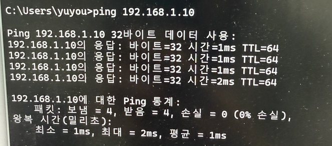

# 🦾 Indy7 Robot Control System

이 프로젝트는 **Neuromeka Indy7** 협동 로봇을 Python과 Pygame을 이용하여 키보드로 실시간 제어(Teleoperation)하기 위한 시스템입니다. 6자유도(Position & Rotation) 제어와 실시간 속도 조절 기능을 포함하고 있습니다.


## 1. 하드웨어 준비 및 네트워크 설정

### 🔌 물리적 연결

* **연결**: 로봇 컨트롤 박스(STEP)의 **LAN 포트**와 제어용 PC를 이더넷 케이블로 직접 연결합니다.


* **IP 주소**: 로봇의 기본 IP는 `192.168.1.10`입니다.



### 💻 PC 네트워크 환경 설정 (Windows 기준)

로봇과 통신하기 위해 PC의 IP를 동일한 대역으로 고정해야 합니다.

1. **제어판 > 네트워크 및 공유 센터 > 어댑터 설정 변경**
2. **이더넷 속성 > 인터넷 프로토콜 버전 4(TCP/IPv4) 속성**
3. **다음 IP 주소 사용** 체크:
* **IP 주소**: `192.168.1.100` (10 제외 2~254 사이)
* **서브넷 마스크**: `255.255.255.0`
* **기본 게이트웨이**: `192.168.1.1`

---

인디7의 조작 시작 자세


---

## 2. 파일 구조 및 설명

현재 프로젝트 폴더(`indy7/`) 내의 주요 파일 역할입니다.

| 파일명 | 설명 |
| --- | --- |
| `indy7_keyboard_control_v1.py` | **메인 제어 코드**. Pygame 기반 6축 키보드 제어 수행 |
| `indy7_start.py` | 로봇의 상태를 확인하고 실행 가능 여부를 체크하는 코드 |
| `check_teleop.py` | 텔레오퍼레이션(Teleop) 모드가 활성화 가능한지 확인 |
| `error.py` | 로봇 에러 발생 시 초기화 및 복구(Recover) 수행 |
| `indy7_shutdown.py` | 로봇을 홈 포지션으로 이동시킨 후 모터를 안전하게 잠금 |
| `restart.py` | 인디7 로봇 시스템을 재시작 |
| `indy7_controller.py` | 컨트롤러(조이패드 등) 조작용 코드 (미완성) |
| `indydcp3_example.ipynb` | 뉴로메카에서 제공하는 기본 DCP3 SDK 예제 파일 |

---

## 3. 키보드 조작 방법 (Manual)

`indy7_keyboard_control_v1.py` 실행 시 적용되는 조작 맵입니다. 6축의 모든 움직임을 지원합니다.

### 🕹️ 이동 및 회전 제어

| 기능 | 키 (Key) | 설명 |
| --- | --- | --- |
| **X축 이동** | `W` / `S` | 로봇 기준 앞(+) / 뒤(-) 이동 |
| **Y축 이동** | `A` / `D` | 로봇 기준 좌(+) / 우(-) 이동 |
| **Z축 이동** | `Q` / `E` | 로봇 기준 위(+) / 아래(-) 이동 |
| **RX (Roll)** | `U` / `O` | 손목 끝 까딱까딱 (기울기) |
| **RY (Pitch)** | `I` / `K` | 손목 끝 끄덕끄덕 (상하각) |
| **RZ (Yaw)** | `J` / `L` | 손목 끝 좌우 회전 (도라이버 동작) |

### 🛠️ 시스템 설정 및 유틸리티

| 기능 | 키 (Key) | 설명 |
| --- | --- | --- |
| **보폭 증가** | `]` | 이동 간격(STEP)을 0.1mm/deg 씩 증가 |
| **보폭 감소** | `[` | 이동 간격(STEP)을 0.1mm/deg 씩 감소 (최소 0.1) |
| **홈 이동** | `SPACE` | 미리 설정된 초기 위치(`target_pos`)로 복귀 |
| **프로그램 종료** | `ESC` | 텔레옵 모드 종료 후 프로그램 안전하게 닫기 |

---

## 4. 실행 가이드

1. **라이브러리 설치**:
```bash
pip install pygame neuromeka

```


2. **로봇 구동 준비**:
* 로봇 전원을 켜고 브레이크를 해제합니다.
* `indy7_start.py`를 실행하여 통신 상태를 확인합니다.


3. **제어 코드 실행**:
```bash
python indy7_keyboard_control_v1.py

```


4. **조작**: 생성된 Pygame 윈도우 창이 활성화된 상태에서 위 표의 키를 입력하여 로봇을 조작합니다.

---

## ⚠️ 안전 주의사항

* **연속 제어 주의**: 키를 꾹 누르고 있으면 로봇이 계속 이동합니다. 장애물과의 거리를 항상 확인하세요.
* **에러 발생 시**: 프로그램이 멈추거나 로봇에 빨간불이 들어오면 `error.py`를 실행하여 복구하세요.
* **비상 정지**: 위급 상황 시에는 로봇 하드웨어의 비상 정지 버튼을 즉시 누르십시오.
