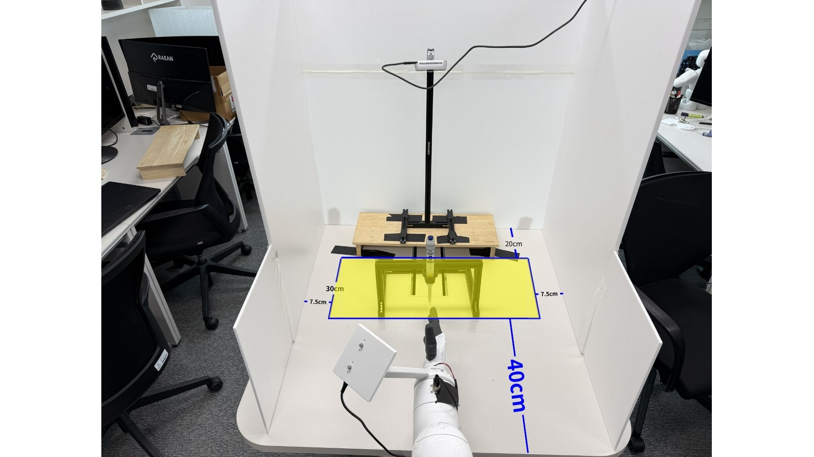

# Data Collection Environment

이 문서는 현재 실제 데이터 수집 환경에서 지켜야 하는 물리 배치 기준을 정리한다.
목표는 episode 사이의 배치는 조금씩 바꾸되, 학습 태스크가 흔들릴 정도의 환경 변화는 막는 것이다.

## 현재 태스크

- 태스크: 홈 포지션에서 시작해 파이펫에 접근한 뒤 파이펫을 잡아서 들어 올리기.
- 성공 기준: 파이펫을 안정적으로 파지하고 거치대/테이블에서 들어 올린 상태.
- 범위 밖: 파이펫을 다른 위치로 옮기거나 거치대에 다시 꽂는 동작은 현재 태스크에 포함하지 않는다.

## 기본 정렬

- 홈 포지션에서 그리퍼 끝점과 손목 카메라 시야 중심을 가능한 한 일직선으로 맞춘다.
- 이 정렬은 현재 눈대중 기준이며, 정밀 캘리브레이션 기준은 아직 없다.
- 파이펫 위치는 episode마다 바뀔 수 있다.
- 파이펫 각도는 기본적으로 고정한다. 사람이 배치하거나 조작하는 과정에서 생기는 작은 각도 오차는 허용한다.
- 테이블 높이는 약 72cm이다.
- Indy7의 절대 위치는 현재 별도 좌표로 문서화하지 않는다. 홈 포지션에서의 일직선 정렬, 테이블 기준 배치, 그리퍼와 작업 영역의 겹침 정도로 상대 위치를 판단할 수 있기 때문이다.

## 파이펫 거치대 배치 가능 영역

- 위 이미지의 노란색 영역을 파이펫 거치대 배치 가능 영역으로 본다.
- 파이펫 거치대는 episode 시작 시 노란색 영역 밖으로 벗어나면 안 된다.
- 여기서 40cm는 파이펫과 거치대 사이 거리 제한이 아니라, 테이블 기준 전방 제한선이다.
- 노란색 영역은 현재 사진/테이프 기준의 작업 영역이다. 정확한 좌표계 기준점은 추후 정교화가 필요하다.

현재 운용 기준:

- 거치대 전체 외곽이 노란색 영역 안에 남아 있어야 한다.
- 거치대가 전방 40cm 제한선을 넘어 로봇 쪽으로 더 가까이 오면 안 된다.
- 좌우로도 노란색 영역의 파란 경계선을 넘기지 않는다.
- 영역 경계에 걸친 애매한 배치는 피하고, 가능하면 테이프 안쪽으로 몇 cm 여유를 둔다.

## 정교화가 필요한 기준

추후 재현성을 높이려면 다음 중 하나를 물리 기준점으로 고정한다.

- 홈 포지션 그리퍼 끝점의 테이블 수직 투영점.
- 테이블 전방 40cm 제한선의 중앙점.
- 나무판/카메라 거치 구조물의 중앙선.

이 기준점이 정해지면 노란색 영역을 `x_min`, `x_max`, `y_min`, `y_max` 같은 테이블 좌표로 다시 정의한다.

## 참고 이미지

- `1.jpg` - 오버헤드 카메라 높이/거치 구조.
- `2.jpg` - 그리퍼와 손목 카메라 정렬 참고.
- `4.jpg` - 나무판과 거치 구조 치수.
- `5.jpg`, `6.jpg` - 오버헤드 카메라 각도와 오프셋 참고.
- `7.jpg` - 전체 작업 공간과 홈 포지션 기준.
- `3.jpg` - 파이펫 거치대 배치 가능 영역.
